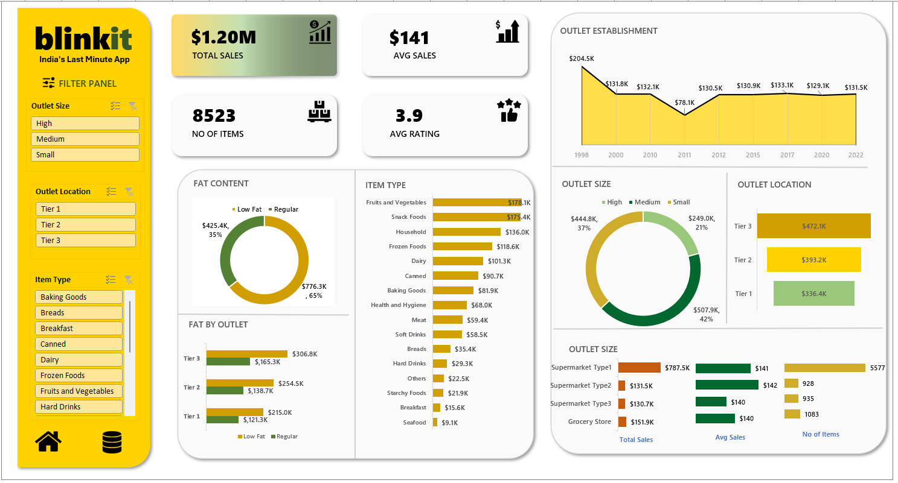

# 🚀 Blinkit Sales Analysis 📊

## 📌 Project Overview
This project analyzes Blinkit's sales data using key performance indicators (KPIs) and insightful visualizations. The analysis helps in understanding sales trends, product performance, and outlet-level insights.

---
- 📊 **Dashboard:** .
  - 


## 📊 Key Performance Indicators (KPIs)

- 🛂 **Total Sales:** A measure of overall revenue generated.
- 📈 **Average Sales:** The average revenue per transaction.
- 🛆 **Number of Items Sold:** Total products sold across outlets.
- ⭐ **Average Rating:** Customer ratings for products and services.

(Data values should be updated dynamically based on the dataset)

---
## 📊 Visualizations & Insights

### 1⃣ Total Sales by Fat Content 🥑
   - Comparison of total sales based on fat content in food items.

### 2⃣ Total Sales by Item Type 🍜
   - Identifies top-performing product categories.

### 3⃣ Fat Content by Outlet for Total Sales 🏦
   - Analyzes how fat content distribution impacts sales at different outlets.

### 4⃣ Sales by Outlet Size 📏
   - Evaluates sales distribution based on outlet sizes (Small, Medium, Large).

### 5⃣ Sales by Outlet Location 🌍
   - Understands sales trends in different geographic locations.

### 6⃣ All Metrics by Outlet Type 🏢
   - Comprehensive insights into sales, fat content, and other KPIs based on outlet types.

---
## 📂 Features 🌻

- **🔍 Filter Panel:** Filter data by outlet location type, outlet size, and item type.
- **📈 Outlet Establishment Trend:** Visualizes outlet growth from 2012 to 2022.
- **🌮 Fat Content Analysis:** Sales breakdown by low-fat and regular-fat products.
- **🍔 Item Type Distribution:** Sales distribution across product categories.
- **🗓 Outlet Size & Location Analysis:** Sales insights by outlet size and location.
- **💼 Outlet Type Comparison:** Compares different outlet types on sales, number of items, ratings, and visibility.

---
## 📂 Files & Directories 📝

- 📄 **Dataset:** [Download Here](https://drive.google.com/drive/folders/1yW3iDT4J-fcXLC-vMwbWEPXzQsaRztYf?usp=sharing) *(Provide dataset link)*
- 📊 **Pivot Tables:** 
  - 
  - 
  - 
  - 
- 📊 **Dashboard:** .
  - 

---
## 🛠️ Technologies Used
- Excel 📊 (Pivot Tables, Dashboards)
- Data Visualization 📉

---
## 📌 How to Use
1. Open the `pivote_table/` folder to explore sales trends.
2. View `dashboard_report.xlsx` for a detailed visual analysis.
3. Use the dataset for further insights and custom analysis.

---
## 💡 Conclusion
This analysis provides actionable insights into Blinkit's sales performance, helping optimize product offerings, understand outlet sales distribution, and improve customer experience.

🎯 **Future Scope:** Implementing machine learning for demand forecasting and sales predictions!

---
## 🔗 Clone the Repository
To clone this repository, run the following command:
```sh
 git clone <repository_link>
```
(Replace `<repository_link>` with the actual repository URL)

🚀 **Happy Analyzing!** 🔍📊
